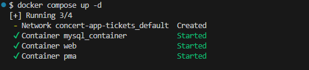
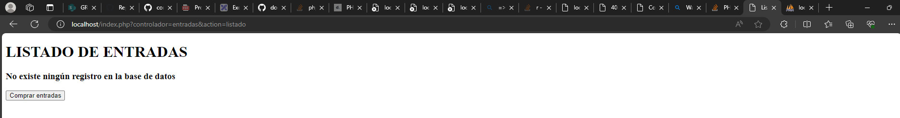
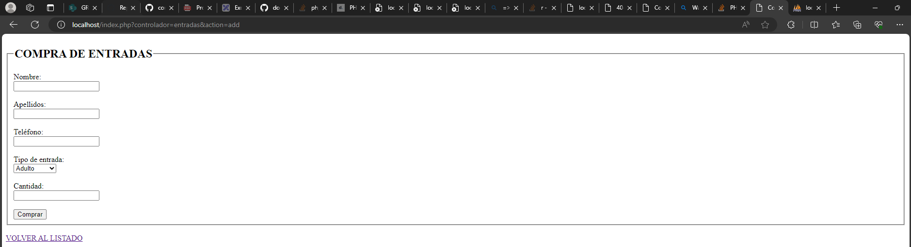
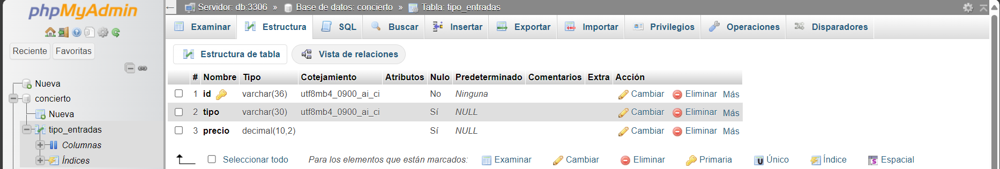
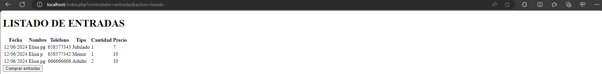

# Contenerización de la app

Para la contenerización de la app se utiliza Docker. Para ello se crean los archivos:
- ``Dockerfile``: contiene todas las capas necesarias para la creación de la imagen de la app de PHP.
- ``docker-compose.yaml``: contiene todos los pasos necesarios para la creación de los contenedores de mysql, phpmyadmin y aplicación de PHP.

### Creación de imágenes y contenedores

Para la creación de las imágenes y contenedores hay que utilizar el siguiente comando:

``` 
docker compose up -d
```
Se obtiene esta salida en la terminal que indica que se han creado correctamente:



### Comprobación del funcionamiento de la app

Se accede en el navegador a http://localhost y se obtiene:



Si se hace click en ``comprar entradas``:



# Base de datos

Se accede a phpmyadmin http://localhost:8081/ con los credenciales:

- Servidor: db
- Usuario: root
- Contraseña: 1234

### Creación base de datos

Se crea la base de datos ``concierto``:

```
CREATE DATABASE IF NOT EXISTS concierto;
```

### Creación de tablas 

Se crea la tabla ``tipo_entradas``:

```
USE concierto;
CREATE TABLE IF NOT EXISTS tipo_entradas (
    id VARCHAR(36) NOT NULL,
    tipo VARCHAR(30),
    precio DECIMAL(10, 2),
    PRIMARY KEY (id)
);
```

Se crea la tabla ``entradas``:

```
USE concierto;
CREATE TABLE IF NOT EXISTS entradas (
    id VARCHAR(36) NOT NULL,
    fecha DATE,
    nombre VARCHAR(15),
    apellidos VARCHAR(30),
    telefono VARCHAR(9),
    tipo_entrada VARCHAR(36),
    cantidad INT,
    precio DECIMAL(10, 2),
    PRIMARY KEY (id),
    FOREIGN KEY (tipo_entrada) REFERENCES tipo_entradas(id)
);
```

Se insertan los datos en ``tipo_entradas``:

```
USE concierto;
INSERT INTO tipo_entradas (id, tipo, precio) VALUES
(UUID(), 'Menor', 10),
(UUID(), 'Adulto', 5),
(UUID(), 'Jubilado', 7);
```



### Comprobar la creación de la entrada

Se rellena el formulario y redirige al listado de las entradas:


