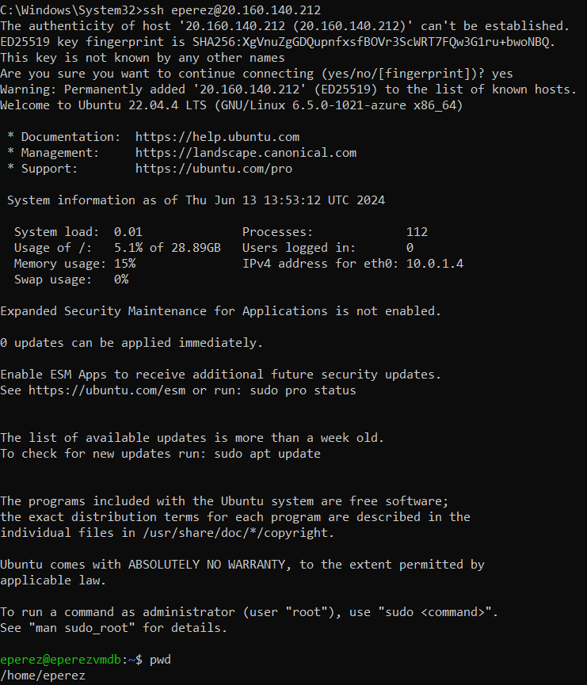
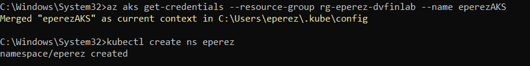
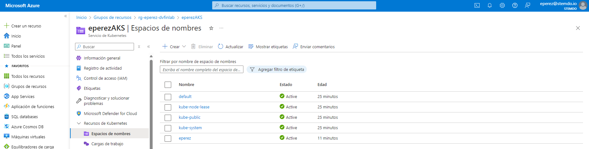
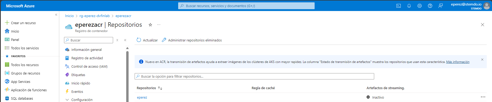

# Conexión a la MV

1. Se crea regla de seguridad para permitir SSH en el puerto 22
2. Se crea ip pública para la MV
3. Se generan las claves ssh pública y privada

```
ssh-keygen -m PEM -t rsa -b 4096 -f C:\Users\eperez\.ssh\id_rsa
```

Se obtiene la siguiente salida en la terminal:

```
Generating public/private rsa key pair.
C:\Users\eperez\.ssh\id_rsa already exists.
Overwrite (y/n)? y
Enter passphrase (empty for no passphrase):
Enter same passphrase again:
Your identification has been saved in C:\Users\eperez\.ssh\id_rsa
Your public key has been saved in C:\Users\eperez\.ssh\id_rsa.pub
The key fingerprint is:
SHA256:CHSlBiPh13eOP2frkgO+tq4Hyg9waeLWiIZJFduLDYI eperez@eperez-
The key's randomart image is:
+---[RSA 4096]----+
|  oo+ ...        |
|.. o+= .         |
|E..+o.+ . .      |
|  o.++.o +       |
| .o.+o. S .      |
|o+ B  . ..       |
|+.+.o. o .o.o    |
|..  o.  + ++ .   |
|     .o=+o +o    |
+----[SHA256]-----+
```

En la creación del recurso MV en Terraform se configura la clave ssh: 

```
admin_ssh_key {
    username   = each.value.admin_username
    public_key = file("C:/Users/eperez/.ssh/id_rsa.pub")
  }
```
Donde username es el nombre de usuario de la mv y public_key apunta al archivo donde se almacena la clave

Como último paso se hace la conexión a la mv con el comando:

```
ssh eperez@20.160.140.212
```

donde eperez es el nombre de usuario de la mv y la ip es la ip pública asignada a la mv (se puede ver en el portal de azure accediendo al recurso de la mv)



# Conexión al cluster 

Para la conexión al cluster se utiliza el comando:

```
az aks get-credentials --resource-group rg-eperez-dvfinlab --name eperezAKS
```

Una vez conectado se crea un namespace para comprobar que funciona:



Se comprueba en el portal de Azure que el cluster se ha creado:




# Azure Container Registry

1. Se crea un azure container registry con Terraform
2. Login en Azure Container Registry
```
az acr login --name eperezacr
```
3. Se contruye la imagen

```
docker build -t my-php-app .
```

4. Se añade una etiqueta a la imagen 

```
docker tag my-php-app eperezacr.azurecr.io/eperez:1
```

5. Se sube la imagen 

```
docker push eperezacr.azurecr.io/eperez:1
```

6. Se comrpueba que se haya subido la imagen al portal de Azure



